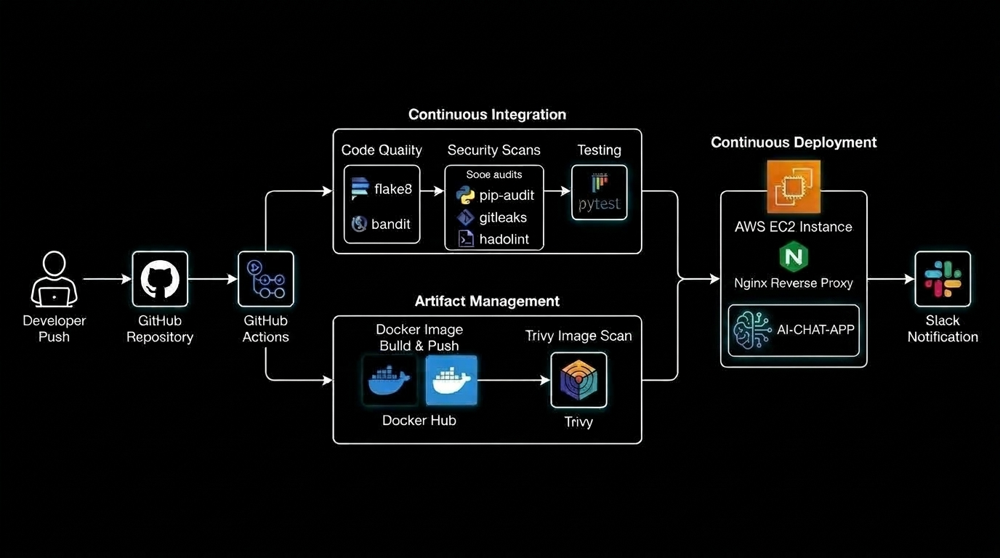

# 🚀 AI-Chat Application Deployment with GitHub Actions CI/CD
## End-to-End Automated CI/CD Pipeline with Security

An AI Chat Application created using Flask, with an automated CI/CD pipeline built entirely using GitHub Actions with DevSecOps concepts.

The app communicates with Groq's OpenAI-compatible chat completions API using the `openai/gpt-oss-20b` model.

## Project Structure

```text
ai-chat-app/
├── .github/
│   └── workflows/
│       ├── Slack-Notify.yml
│       ├── code-quality.yml
│       ├── dependency-check.yml
│       ├── deploy-to-server.yml
│       ├── main-cicd-pipeline.yml
│       ├── docker-build-push.yml
│       ├── image-scan.yml
│       ├── scan-dockerfile.yml
│       ├── secrets-scan.yml
│       └── tests.yml
├── nginx/
│   └── default.conf
├── templates/
│   └── index.html
├── .gitignore
├── app.py
├── docker-compose.yml
├── Dockerfile
├── gunicorn.conf.py
├── README.md
├── requirements.txt
└── test_app.py
```

## Why This Repo Exists

This project demonstrates an automated deployment flow for an AI chat service integrated with core DevSecOps concepts:

- **Enforced Code Quality**: Linting and static analysis on code pushes
- **Dependency & Secrets Scanning**: Automated package vulnerability checks and Git history secret detection
- **Dockerfile & Image Security**: Dockerfile linting and Trivy container vulnerability scanning
- **Automated Testing**: Unit/route testing via Pytest
- **Secure Deployment**: Remote SSH deployment using Docker Compose and Nginx reverse proxy
- **Slack Notifications**: Automated alerts for pipeline success or failure status

## CI/CD Pipeline Architecture



```text
Push to main ➔ Triggers CICD Workflow ➔ [1] Code Quality ➔ [2] Security Scans ➔ [3] Pytest ➔ [4] Docker Build ➔ [5] Trivy Scan ➔ [6] EC2 Deploy ➔ [7] Slack Alert
```


The master pipeline is defined in `main-cicd-pipeline.yml`. On `push` to `main`, it executes the following modular workflows in structured stages:

| Workflow | Purpose | Key Tools |
|---|---|---|
| [`code-quality.yml`](.github/workflows/code-quality.yml) | Validate code style and application static security | `flake8`, `bandit` |
| [`dependency-check.yml`](.github/workflows/dependency-check.yml) | Scan Python dependencies for known CVEs | `pip-audit` |
| [`secrets-scan.yml`](.github/workflows/secrets-scan.yml) | Detect exposed secrets in Git history | `gitleaks` |
| [`scan-dockerfile.yml`](.github/workflows/scan-dockerfile.yml) | Validate Dockerfile syntax & security practices | `hadolint` |
| [`tests.yml`](.github/workflows/tests.yml) | Run unit and route tests | `pytest` |
| [`docker-build-push.yml`](.github/workflows/docker-build-push.yml) | Build and push Docker image to Docker Hub | `docker/build-push-action` |
| [`image-scan.yml`](.github/workflows/image-scan.yml) | Scan container image for HIGH and CRITICAL vulnerabilities | `trivy` |
| [`deploy-to-server.yml`](.github/workflows/deploy-to-server.yml) | Deploy containerized app to EC2 production server via SSH | `appleboy/ssh-action`, `docker compose` |
| [`Slack-Notify.yml`](.github/workflows/Slack-Notify.yml) | Send pipeline status alerts to Slack | `ravsamhq/notify-slack-action` |

### Pipeline Execution Order

1. **Stage 1 - Quality**: `code-quality.yml` checks code standards.
2. **Stage 2 - Security**: `dependency-check.yml`, `secrets-scan.yml`, and `scan-dockerfile.yml` run in parallel once code quality passes.
3. **Stage 3 - Testing**: `tests.yml` executes Pytest suite after security scans pass.
4. **Stage 4 - Build**: `docker-build-push.yml` builds and pushes the image to Docker Hub.
5. **Stage 5 - Image Audit**: `image-scan.yml` scans the pushed Docker image using Trivy.
6. **Stage 6 - Deployment**: `deploy-to-server.yml` SSHs into the server to pull and restart the application stack.
7. **Stage 7 - Notification**: `Slack-Notify.yml` fires a notification containing execution status.

## Getting Started

1. **Fork or Clone this repository**.
2. **Configure GitHub Secrets & Variables** — go to repo **Settings → Secrets and Variables → Actions**:
   * **Secrets**:
     - `GROQ_API_KEY`: Your Groq API Key (from [Groq Console](https://console.groq.com/keys))
     - `DOCKERHUB_TOKEN`: Docker Hub Personal Access Token
     - `EC2_SSH_HOST`, `EC2_SSH_USER`, `EC2_SSH_PRIVATE_KEY`: Server deployment SSH credentials
     - `SLACK_WEBHOOK_URL`: Slack Incoming Webhook URL for build notifications
   * **Variables**:
     - `DOCKERHUB_USER`: Your Docker Hub username
3. **Push to `main`** — the CI/CD pipeline will automatically trigger.
4. **Manual Triggers** — Go to the Actions tab → Select any workflow → Run workflow manually.

> **Note**: Deployment and image scan stages require valid Docker Hub and EC2 server credentials. Pre-deployment CI jobs (`code-quality`, `dependency-check`, `secrets-scan`, `scan-dockerfile`, `tests`) work out of the box.

## Application Architecture & Stack

- **Backend**: Flask (`app.py`), Gunicorn (`gunicorn.conf.py`) WSGI server listening internally on port `5000`.
- **Reverse Proxy**: Nginx (`nginx/default.conf`) listening on public port `80`, proxying requests to Flask container.
- **AI Model**: Groq API integration using `llama-3.3-70b-versatile` (or model configured in Flask app).
- **Dependencies**: Listed in `requirements.txt` (Flask, requests, gunicorn, python-dotenv, etc.).

---

**Prince Vaishnav**
- **Email**: vaishnavprince995@gmail.com
- **LinkedIn**: [https://www.linkedin.com/in/prince-vaishnav-b685a0319/](https://www.linkedin.com/in/prince-vaishnav-b685a0319/)

